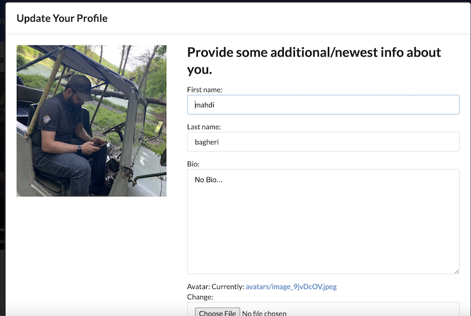
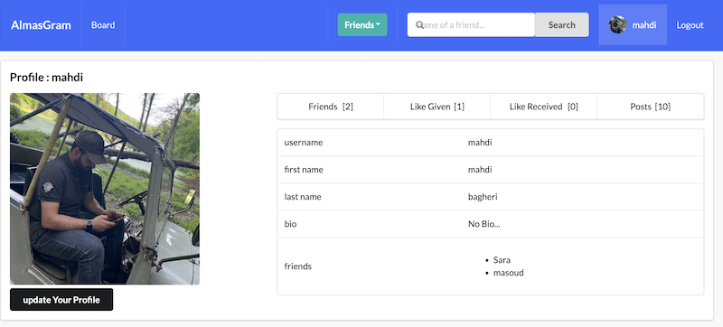
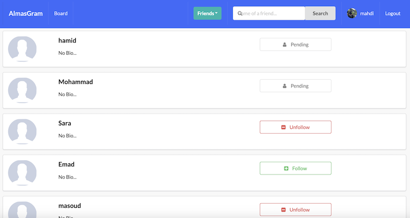
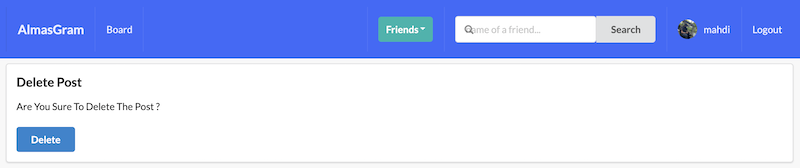
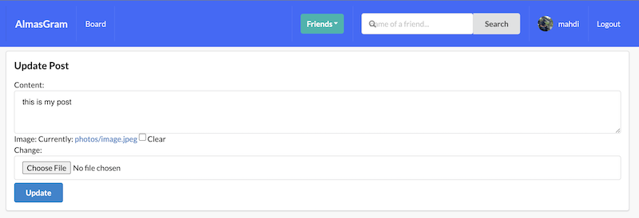

# Django Social Media Project

## Description

This Django-based social media project is designed as a versatile and feature-rich platform for users to connect, share, and interact. It incorporates a range of functionalities including user profiles, posts, comments, likes, and media management. The project employs Django, Django all-auth, Font Awesome, and Bootstrap for seamless development and styling. This README provides an in-depth overview of the project's features and structure.

## Features

### User Authentication

- User Registration: New users can register with a valid email address.
- User Login: Users can log in to their accounts using their registered email and password.
- Password Management: Password reset and change functionalities are available, providing enhanced security.
- Email Verification: Users must verify their email addresses during registration for added security.

### User Profiles

- Profile Creation: Users can create detailed profiles with personal information and profile pictures.
- Profile Editing: Users have the ability to edit their profiles and update profile pictures.
- Profile Viewing: Users can view the profiles of other users.
- Automatic Profile Creation: A signal ensures that a profile is automatically created for each registered user.

### Posts

- Post Creation: Users can create, edit, and delete posts, enhancing their content-sharing capabilities.
- Comments: Each post can be commented on, facilitating discussions and interactions.
- Likes: Users can like posts, and the project keeps track of like counts.
- Post Count Information: The project maintains information on post counts for each user.

### Friends and Connections

- Friend Requests: Users can send and accept friend requests.
- Friend Lists: Users can view their friend lists and manage their connections.
- Automatic Friend Management: Signals handle friend relationships, ensuring consistency and user experience.

### Following and Unfollowing

- User Following: Users can follow other users, establishing a one-way connection.
- User Unfollowing: Users can unfollow other users, discontinuing their connection.

### Blocking and Privacy

- User Blocking: Users can block other users, preventing interactions and notifications.
- Privacy Control: Blocked users do not appear in the friend request list of those who have blocked them.

### Pending Friend Requests

- Pending Friend Requests: When a user sends a friend request, it remains pending until the other user accepts or rejects it.

### Media and Static Files

- Media Storage: The project manages media files such as images, making them accessible to users.
- Static Files: Static files, including CSS and JavaScript, are organized and loaded with Django's static file handling.

## Project Structure

### Profiles App

- `profiles`: This app manages user profiles, friend requests, following, blocking, and privacy settings.
- `signals.py`: Signals for creating profiles, managing friend relationships, following, and blocking.
- `forms.py`: Forms for creating profiles and interacting with posts.
- `models.py`: Contains the Profile, Relationship, and FriendRequest models, defining the structure of user profiles and connections.
- `views.py`: Views for profiles and connections, utilizing function-based views, generic views, and decorators for security.

### Posts App

- `posts`: This app handles the creation and management of posts.
- `forms.py`: Forms for creating and editing posts, comments, and images.
- `models.py`: Contains Post, Comment, Like, and Image models to structure post-related data.
- `views.py`: Views for posts, utilizing function-based views, generic views, and decorators for security.

### Templates and Frontend

- `templates`: The directory containing HTML templates for the project.
- Static and media files are organized using Django's static and media file handling.

### Utilities

- `utils.py`: A utility function for generating random registration codes.
- `context_processors.py`: Handles context processors for profile pictures and invitation numbers.

### Technologies Used

- Django: A powerful Python framework for building web applications.
- Django all-auth: An authentication system for user registration, login, and more.
- Font Awesome: A collection of scalable vector icons for enhancing the project's user interface.
- Bootstrap: A front-end framework for creating responsive and stylish web applications.
- SQLite3: A lightweight and easy-to-set-up database system.

### Images

---

---

---

---

